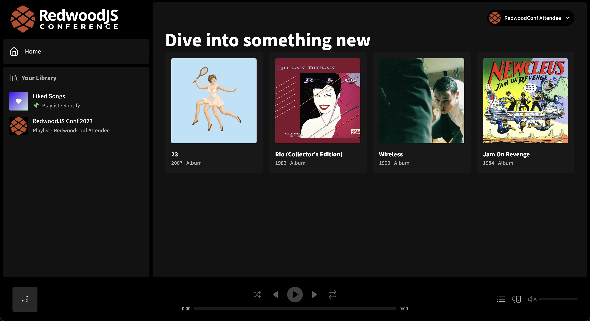

# Workshop setup

This setup guide will walk you through the prerequisites needed for the workshop. This setup process is crucial to ensure the remaining exercises function as expected.

## Get started

1. Install dependencies

   ```
   yarn
   ```

2. Generate a secret.

   ```
   yarn rw g secret
   ```

3. Copy the secret from the previous step and add it to your `.env` at the root of this `00-setup` directory as the `SESSION_SECRET`. Your `.env` file should look similar to the following:

   ```
   SESSION_SECRET=VALUE_FROM_PREVIOUS_STEP
   ```

4. Apply the database schema to your database.

   ```
   yarn rw prisma migrate dev
   ```

5. Seed the database with Spotify data.

   ```
   yarn rw prisma db seed
   ```

   > NOTE: If you'd like to customize the user or device information for the workshop, see the [workshop customization](#customize-your-workshop-app) section for more information.

6. Start the app

```
yarn rw dev
```

If everything works as expected, you should see a home screen with the contents of this README. You may continue these instructions in the browser or proceed to log into the app. Logging in will ensure your database is setup correctly. Once logged in, you should see a grid of albums along with the "RedwoodJS Conf 2023" playlist in the sidebar.



## Customize your workshop app

You can personalize the workshop app by modifying the `workshop.config.toml` file at the root of this setup directory. This step is not required, though highly encouraged to get the most of your experience.

This configuration allows you to set your display name, avatar, and device information used for playback. Feel free to tweak these settings at any time throughout the workshop. Just be sure to [apply your changes](#applying-changes) when doing so.

### Applying changes

Changes to the `workshop.config.toml` file can be applied by running the seed script.

```sh
yarn rw prisma db seed
```

> NOTE: You may execute the seed script as often as you'd like. The data will be updated to match any change applied to `workshop.config.toml`.

### Customize your user

You can customize your user information displayed in the user menu. Changes to your user information is done under the `[user]` table header.

#### Change your display name

To change your display name, update the `displayName` property in the `[user]` table. By default this will be "RedwoodConf Attendee".

```toml
[user]

displayName = "RedwoodConf Attendee"
```

#### Change your avatar

To customize your avatar, add a `png` image to `web/public/avatar.png`. By default, the `web/public/defaultAvatar.png` will be used. Adding this file will require you to [apply changes](#applying-changes) to the database by running the seed script, otherwise the default avatar will be displayed.

### Customize your playback device

To replicate the Spotify UI, the app displays a device for playback. Changes to the playback device is done under the `[device]` table header.

#### Change the device name

To change the name of the device, update the `name` property in the `[device]` table. By default this will be "My Computer".

```toml
[device]

name = "My Computer"
```

#### Change the device type

The change the type of the device, update the `type` property in the `[device]` table. By default this will be "computer". Valid values are `computer`, `smartphone` and `speaker`.

```toml
[device]

type = "computer"
```

## You're all set 🎉🔥

If you haven't done so already, [log into](http://localhost:8910/login) the app to check that everything is working. And with that, you're all set 🎉🔥! I truly hope that you enjoy this workshop!

## Troubleshooting

The work performed here will be used by each exercise. Each exercise will link to the database, `workshop.config.toml`, and the `.env` files in this directory. This should be done for you automatically. If you start an exercise and files don't seem to link correctly, run the `setup` script to see if it resolves the issue.

```
yarn rw exec setup
```
