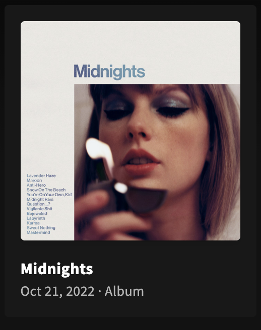
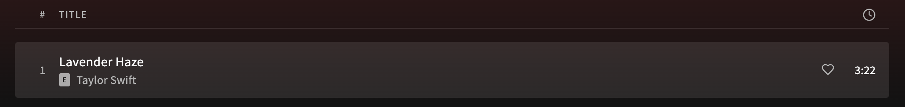

# Exercise 2: Reusable components with fragments

In this exercise, we will again be utilizing GraphQL fragments to declare data needs for a _reusable_ component that is used on more than one page in more than one query.

## Setup

1. Install dependencies
   ```
   yarn
   ```
2. Start the app
   ```
   yarn rw dev
   ```

You should now be running the app in the same state as you saw it in the [exercise 1](https://github.com/jerelmiller/redwoodjs-conf-2023-workshop/tree/main/01-component-fragments).

> NOTE: All components from exercise 1 have been updated to include their fragment definitions. You can find these in the [`web/src/workshop/completed/components`](https://github.com/jerelmiller/redwoodjs-conf-2023-workshop/tree/main/02-reusable-components-with-fragments/web/src/workshop/completed/components) directory.

## Challenge

In this exercise, we have 2 different components that are used on multiple pages in our app. These components do not have fragment declarations but do get their data via props.

Our (hypothetical) designer has noticed some areas for improvement with our app, including a straight up bug with the display of our tracks. Each of these components are used in multiple places in our app.

First up, our album tile is looking a little sparse. We'd like to include some more information about the album on the tile such as the release date and album type. Let's update this component to display the additional information. When finished, our album tile should look like the following:



Our (hypothetical) designer has also noticed that our track details on the playlist, album, and liked tracks pages do not indicate whether the track is explicit or not and has such angered some of our users. Let's fix this bug to show an explicit badge with the track information to denote if the track is explicit. When finished, our track details should look like the following:



## Exercise

Using what we've learned from the first exercise, let's update our components to declare their own fragment declarations so that we can easily request additional data from the server to address our 2 issues.

Like the first exercise, these components can be found in the `web/src/workshop/components` directory. This directory contains the 2 components that we will be working with in this exercise.

### `<AlbumTile />`

This component is rendered on both the [home page](http://localhost:8910/) and the [artist page](http://localhost:8910/artists/06HL4z0CvFAxyc27GXpf02). We can use some pre-built components and utilities to nicely format the album details under the title.

- [`<MediaTileDetails />`](https://github.com/jerelmiller/redwoodjs-conf-2023-workshop/blob/main/02-reusable-components-with-fragments/web/src/components/MediaTileDetails/MediaTileDetails.tsx) - Accepts a `children` prop and renders the nice delimeter between each detail
- [`<ReleaseDate />`](https://github.com/jerelmiller/redwoodjs-conf-2023-workshop/blob/main/02-reusable-components-with-fragments/web/src/components/ReleaseDate/ReleaseDate.tsx) - Parses and formats a `ReleaseDate` type in our GraphQL schema.
- [`capitalize`](https://github.com/jerelmiller/redwoodjs-conf-2023-workshop/blob/43960a1576d08fc44c67171d004827db2567523c/02-reusable-components-with-fragments/web/src/utils/string.ts#L1-L2) - We can use this to nicely display the album type in the tile.

When finished, our details JSX should resemble the following:

```tsx
import MediaTileDetails from 'src/components/MediaTileDetails'
import ReleaseDate from 'src/components/ReleaseDate'
import { capitalize } from 'src/utils/string'

const AlbumTile = ({ album }) => {
  return (
    // ...
    <MediaTileDetails>
      <ReleaseDate releaseDate={album.releaseDate} />
      <span>{capitalize(album.albumType.toLowerCase())}</span>
    </MediaTileDetails>
    // ...
  )
}
```

As extra credit, feel free to add or change album details displayed on the album tile to customize the information to play around with this pattern.

### `<TrackTitleTableCell />`

This component is rendered on the [playlist page](http://localhost:8910/playlists/6dct72C91vKsJtsznrCAm3), [album page](http://localhost:8910/albums/151w1FgRZfnKZA9FEcg9Z3), and [liked songs page](http://localhost:8910/collection/tracks). We can use the [`<ExplicitBadge />`](https://github.com/jerelmiller/redwoodjs-conf-2023-workshop/blob/main/02-reusable-components-with-fragments/web/src/components/ExplicitBadge/ExplicitBadge.tsx) component to denote the track as explicit.
