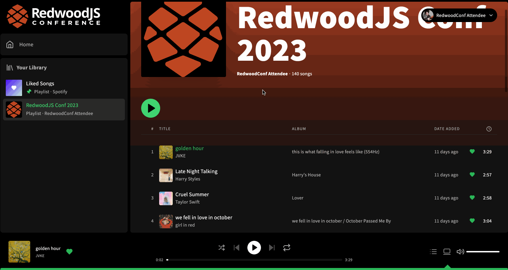

# Exercise 4: Infinite scroll pagination

In this exercise, we will dive deeper into type policies by adding support for infinite scroll pagination in our app.

## Setup

1. Install dependencies
   ```
   yarn
   ```
2. Start the app
   ```
   yarn rw dev
   ```

You should now be running the app in the same state as you saw in [exercise 3](https://github.com/jerelmiller/redwoodjs-conf-2023-workshop/tree/main/03-state-management-with-useFragment) with the UI in sync with the playback state.

## Challenge

We notice our "RedwoodJS Conf 2023" playlist is only displaying 20 tracks, yet according to page header, we have 140 tracks in the playlist. If we open our network tab, we see that as we scroll to the bottom of the list, our app tries to query for the next page of data, but the page doesn't seem to re-render with the next set of tracks.

We notice this same behavior on the liked songs page. We only see the 10 most recent liked songs in this list. Like the playlist page, when scrolling to the bottom of the list, we have a query that tries to get the next page of data but our page doesn't rerender.

Our goal by the end of this exercise is to fix both of these pages so that we can load in more tracks as the user scrolls to the bottom.

By the end of this exercise, our UI should behave like the following:



## Exercise

We will be working exclusively with [type policies](https://www.apollographql.com/docs/react/caching/cache-configuration#typepolicy-fields) in this exercise. We will need to adjust our cache settings so that as we fetch more tracks, the newly loaded tracks are concatented with the list of already loaded tracks. We can accomplish this through the use of a [merge function](https://www.apollographql.com/docs/react/caching/cache-field-behavior#the-merge-function) which gives us absolute control over how the data is written to the cache.

You can find the type policies in `web/src/workshop/apollo/typePolicies.ts`.

> NOTE: These type policies have been added to the `<RedwoodApolloProvider />` component in [`web/src/App.tsx`](./web/src/App.tsx). If you were adding type policies to your own app, this is where you'd add them.

For this exercise, we will be working with 2 different GraphQL types and their fields. You can find the list of saved tracks under the `CurrentUser` type's `tracks` field. For a playlist, you can find the list of it's tracks under the `Playlist` type's `tracks` field.
