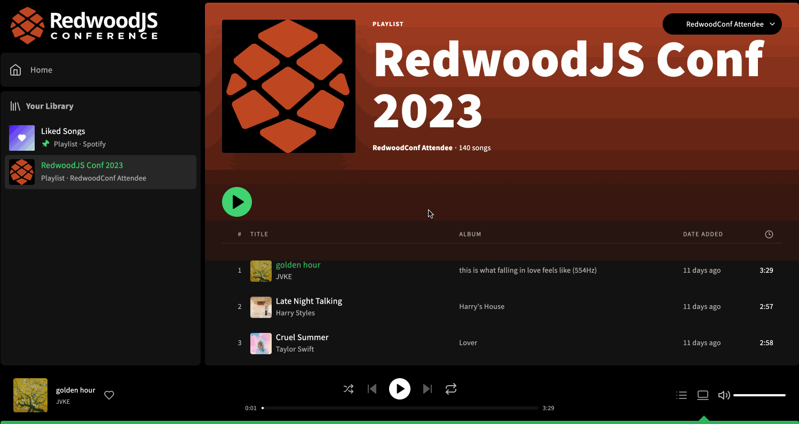

# Exercise 5: Updating a list of data after a mutation

In this exercise, we will be manually writing data to the cache after a mutation. We want to avoid the need to refetch queries from our server when the mutation affects data on other pages in our app.

## Setup

1. Install dependencies
   ```
   yarn
   ```
2. Start the app
   ```
   yarn rw dev
   ```

You should now be running the app in the same state as you saw in [exercise 4](https://github.com/jerelmiller/redwoodjs-conf-2023-workshop/tree/main/04-infinite-scroll-pagination) with the playlist and liked songs pages working with an infinite scroll list.

## Challenge

As we are browing our awesome "RedwoodJS Conf 2023" playlist, some songs caught our eye that we like and want to save in our liked songs list. We are able to successfully add songs to our list, but we notice that once we navigate to our liked songs page, the new songs don't show up and instead require a full refresh of the page to see them.

We also notice that when we remove a song from our liked songs page, our list doesn't update and remove the track. We'd like to avoid having to fully refetch the entire list of data from our server and instead prefer to manipulate the cache directly.

We'd like to fix both of these issues. Liking a song should add the song to our liked songs page as the most recent item. Removing a song from our liked songs page should immediately remove that track from our list.

By the end of this exercise, our app should behave like the following:



## Exercise

In this exercise, we will be modifying mutations to manually write data to the cache when the mutation finishes. When adding a song to our liked songs page, we'd like the song to appear at the top of our list. Removing a liked song should immediately remove it from the list.

In this exercise, we will make use of the Apollo Client [cache write APIs](https://www.apollographql.com/docs/react/caching/cache-interaction). Once our mutation is executed, we will need to interact with the cache to tell it how to add or remove saved tracks.

You can find the saved tracks under the `CurrentUser` type's `tracks` field. This exercise will require us to modify this field to properly add or remove a track, depending on which mutation was executed.
