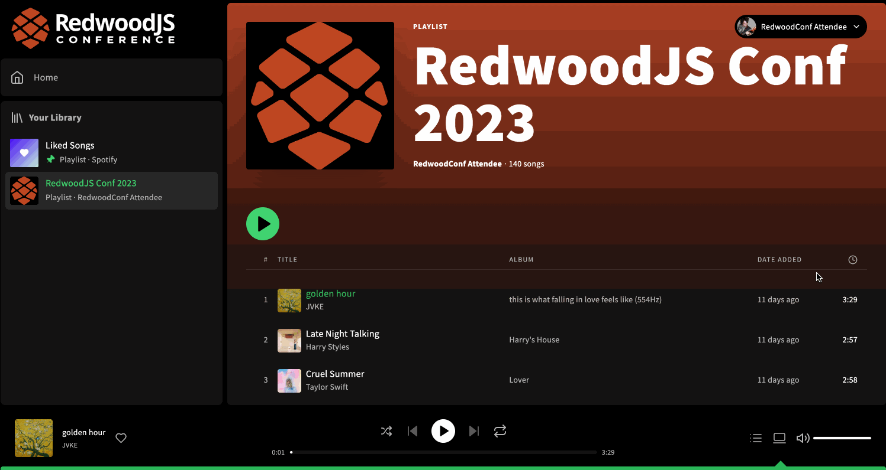

# Exercise 6: Advanced type policy

In this exercise, we will creating an advanced type policy that will allow us to handle cached data for an oddly designed field in our GraphQL schema. We will be using a lesser-known feature of Apollo's `read` and `merge` functions to accomplish this.

## Setup

1. Install dependencies
   ```
   yarn
   ```
2. Start the app
   ```
   yarn rw dev
   ```

You should now be running the app in the same state as you saw in [exercise 5](https://github.com/jerelmiller/redwoodjs-conf-2023-workshop/tree/main/05-update-list-after-mutation) which allows you to add and remove liked tracks with a direct cache write.

## Challenge

We have one last issue with our app which is that as I like and unlike a track, the heart icon next to the track is not properly updated to reflect the current state. We can see our track is properly added or removed from the liked songs page, but we'd really like the heart icon to display properly.

We'd like to fix this issue so that we can like or unlike a track from anywhere in our app.

By the end of this exercise, our app should behave like the following:



## Exercise

In this exercise, we will be adding both [`read`](https://www.apollographql.com/docs/react/caching/cache-field-behavior#the-read-function) and [`merge`](https://www.apollographql.com/docs/react/caching/cache-field-behavior#the-merge-function) functions to our type policy that will allow us to add some custom logic both when we write data to the cache and when we read from it.

In this exercise, we will work with a uniquely designed field in our GraphQL schema. Due to its design, caching data on it is a bit tricky.

Our schema contains a `tracksContains` field on the `CurrentUser` type which takes an array of IDs as an argument and returns an array of booleans. This is used to look up a set of tracks to determine whether they are saved to the user's library or not. As we've learned with `keyFields`, Apollo will cache each combination of arguments separately by default in the cache.

We will explore ways to utilize our cache despite the schema design to ensure we can properly associate the track IDs to the right boolean value.
